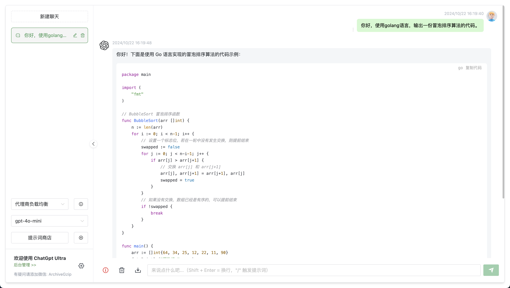
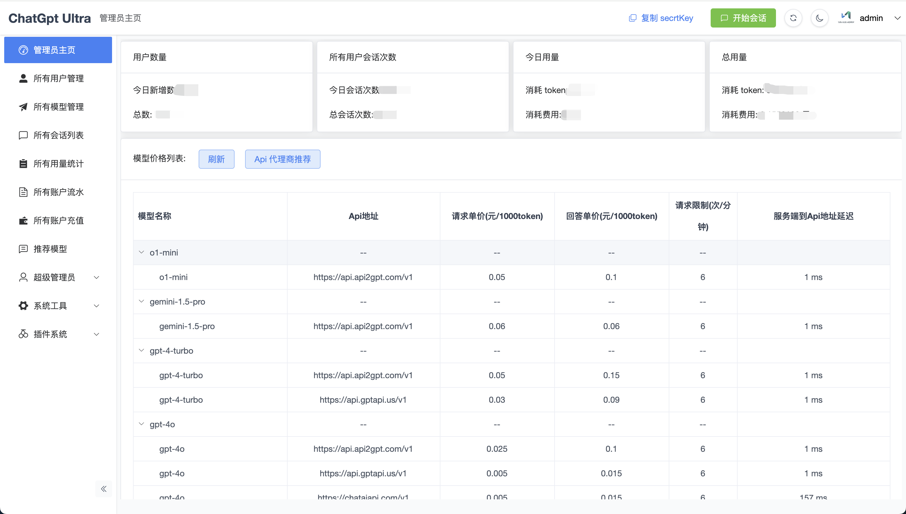
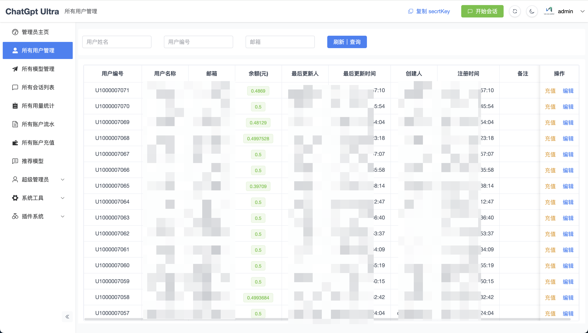
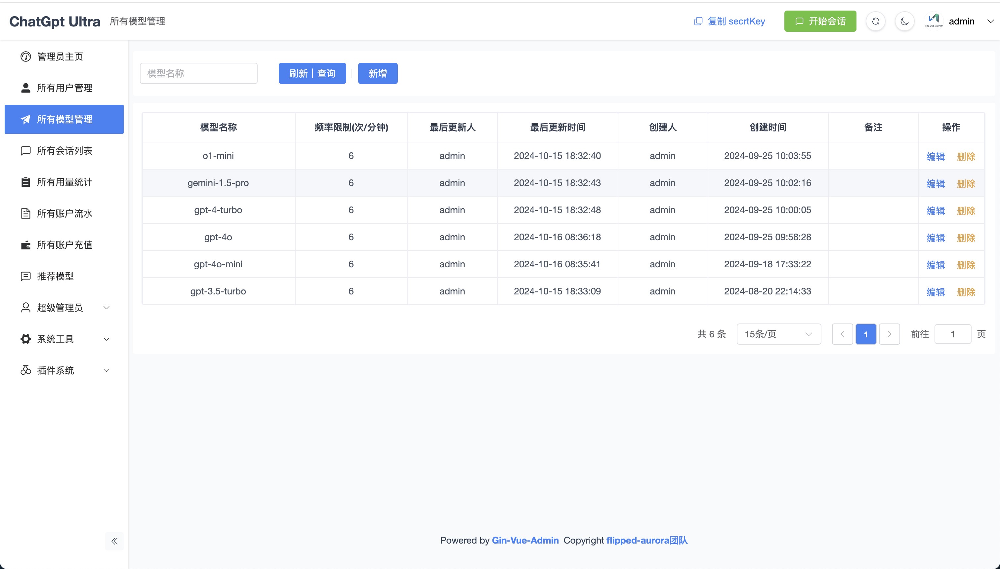
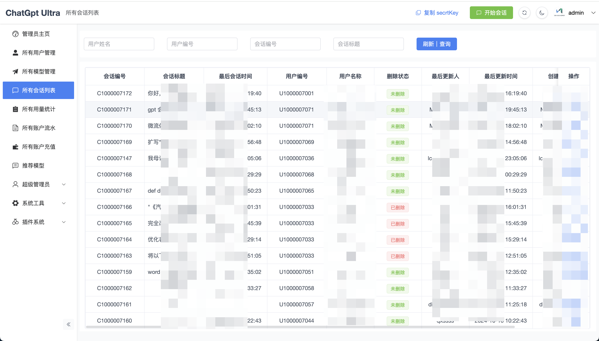
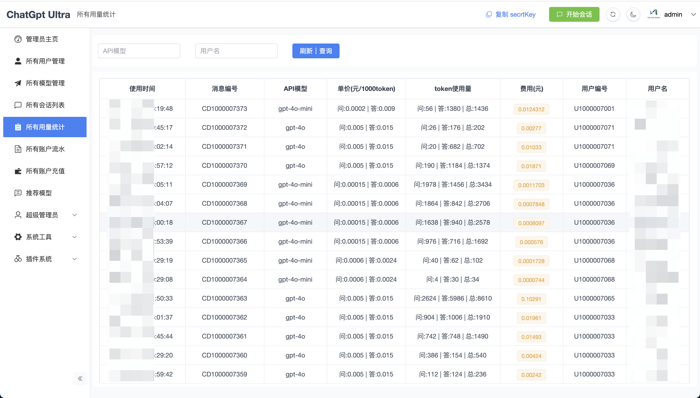
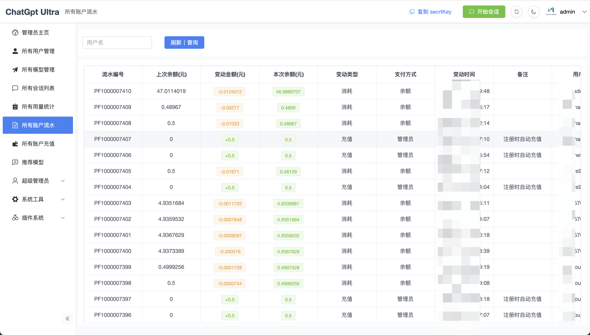
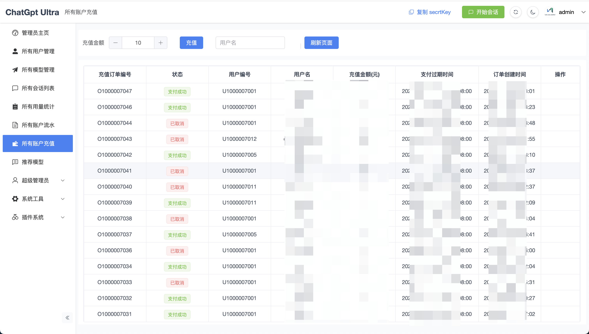
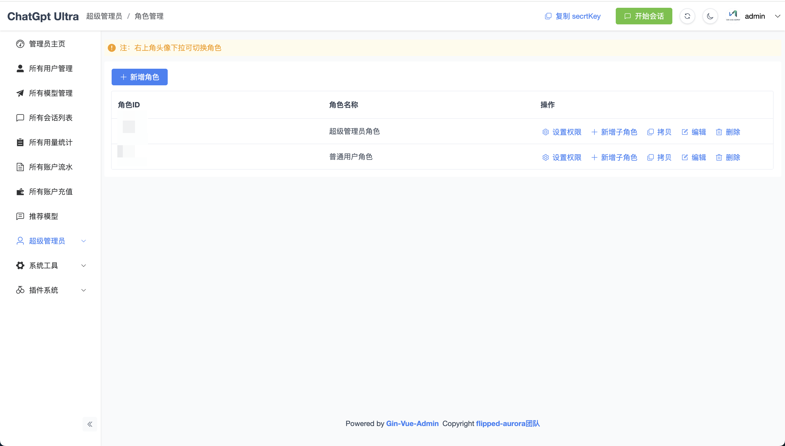

# Chatgpt Ultra

**Chatgpt Ultra** 是基于 openai 标准 API 实现的一套 AI 助手解决方案。开箱即用，开箱即可推广变现。

主要特性：

- 前后端分离。
- 内置大量默认角色，各种聊天应用唾手可得。
- 前台会话体验十分丝滑媲美官方。
- 支持对接 Openai 官方 API，同时支持对接多个第三方代理商 API。
- 会话时支持多种策略模式：代理商负载均衡模式、最低价代理商模式、指定代理商模式等等。
- 管理员端包含如下功能：
  - Dashboard
  - 自带用户注册登录
  - 用户权限管理
  - 用户管理
  - 模型管理
  - 用户会话管理
  - 用户 token 用量统计
  - 用户账户充值「微信、支付宝」
  - 用户余额管理
  - 用户账户流水管理
  - 角色权限管理
  - ...

## 项目截图

#### 前台会话截图：

#### 后台管理员主页截图：

#### 后台用户管理截图：

#### 后台模型管理截图：

#### 后台会话列表截图：

#### 后台用量统计截图：

#### 后台账户流水截图：

#### 后台账户充值截图：

#### 后台角色权限管理截图：

#### 体验地址：
- 前台体验地址：https://chat.magicoo.cc/
- 后台体验地址：https://chat.magicoo.cc/admin

#### 项目开箱即用，代码授权使用请联系微信：
</img>